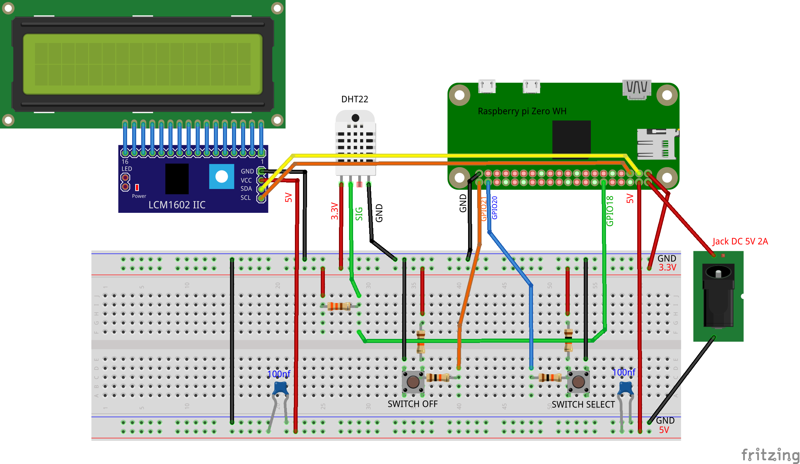

# pimometre
Mini station météo de salon connecté équipée d'un capteur de température et d'humidité pour la température ambiante.
Récupération de prévisions météorologiques via une API Rest. 
Les données sont affichées sur un petit écran LCD de 2 lignes de 16 caractères.


## prototype de test avec capteur et écran LCD

#### choix matériel

* Raspberry pi Zero WH avec Raspbian os lite et WIFI
* 1 capteur température et humidité: DHT22 (précision T°: 0.5°C, précision humidité: 5%)
* 1 résistance 4,7 k ohms
* 1 écran LCD 16*2 avec backpack I2C à base de PCF8574

Pour configurer le piZero: suivez [ce guide](https://www.papsdroid.fr/post/configurer-pizero)


#### test capteur DHT22

Il faut tout d'abord activer l'interface I2C du Raspberry pi avec 
```bach
sudo raspi-config
```
reboot nécessaire.

Pour le capteur DHT22, il faut instaler les dépendances et bilbiothèques circuit-python d'Adafruit en suivant [ce guide](https://circuitpython.readthedocs.io/projects/dht/en/latest/). Pour ce qui me concerne j'ai enchaîné ces commandes:

```bach
sudo pip3 install rpi.GPIO
sudo pip3 install adafruit-blinka
sudo pip3 install adafruit-circuitpython-dht
sudo apt-get install libgpiod2
```


Pour l'afficheur LCD j'ai récupéré la bilbiothèque I2C_LCD_DRIVER.py que je trouve particulièrement bien faite et complète sur [ce site](https://www.circuitbasics.com/raspberry-pi-i2c-lcd-set-up-and-programming/).

Les scripts pythons ci-dessous permettent d'afficher la température et l'humidité ambiante sur le LCD:
* test_LCD_dht22.py
* I2C_LCD_DRIVER.py

Les deux fichiers sont à déposer dans un répertoire /home/pi/pimometre/tests/ du raspberry pi zero.

usage: 
```bach
python3 pimometre/tests/test_LCD_dht22.py
```

#### test API météo

Pour récupérer les prévisions météorologiques locales, il faut d'abord créer un token "standard" sur https://api.meteo-concept.com/

Récupérer votre token, et stockez le dans un fichier texte "tokenAPI.txt", à déposer dans le dossier /home/pimometre/tests, ainsi que le programme python test_meteo_api.py à récupérer parmi les sources.

usage:
```python
cd pimometre/tests
python3 test_meteo_api.py [CP] 
```
en remplaçant [CP] par un code postal dont vous souhaitez les prévisions météo


Pour un même code postal il peut y avoir plusieurs villes: identifiez le code INSEE de la ville pour laquelle vous souhaitez avoir les prévisions météo: ce code sera utilisé pour la suite du projet.

#### première version test du projet: météo interne (capteur) et externe (api).

le programme **pimometre_v1.1.py** dans le répertoire **/tests** permet d'afficher la météo interne capté par le capteur DHT22 (T° et taux d'humidité), ainsi que la température et taux d'humidité exterieure fournie par l'API.

usage: 
```python
cd pimometre/tests
python3 pimometre_v1.1.py [INSEE]
```

remplacer [INSEE] par le code INSEE de votre ville (récupérée via le programme **test_meteo_api.py**) 


Pour pouvoir afficher des informations asynchrones sur un écran (LCD 16*2 en l'occurence), la meilleure solution est de confier la lecture des capteurs à des Threads indépendants. L'application principale consiste à afficher en boucle infinie avec un temps de repos pour ne pas saturer les processeurs ce que les Threads de lecture ont enregistrés la dernière fois qu'ils ont capté quelquechose. Grâce aux Threads On peut ainsi afficher de manière régulière des informations captées par des capteurs qui ne sont absolument pas synchronisés.

Ce programme (orienté objet) contient 3 classes pour gérer l'application:
* Classe **Application**, avec sa boucle principale **loop()** qui affiche en boucle infinie toutes les 2 secondes sur l'écran LCD les lectures faites par le DHT22 et l'appel à l'API météo.
* Classe **DHT22**: capteur interne de T° et humidité. Ce capteur est capricieux et provoque souvent des erreurs de lecture qu'il faut ignorer, et il est conseillé d'attendre au minimum 2 secondes avant de retenter une lecture: un Thread qui lit et enregistre en boucle infinie ce capteur toutes les 2 secondes est particulièrement bien adapté.
* Classe **Meteo**: Thread de lecture de prévision météo via l'api https://api.meteo-concept.com. Ce thread va interroger l'API toutes les 15 mn (60*15 secondes) pour enregistrer la T° et le taux d'humidité de la ville correspondant au code [INSEE] fourni en paramètre lors de l'appel au programme. Attention l'appel à cette API nécessite que vous aillez au préalable **déclaré votre propre token dans le fichier de configuration tokenAPI.txt**

Une seconde version du programme **pimometre_v1.2.py** va permettre de faire défiler plusieurs informations sur la ligne des prévisions météos: température et humidité extérieure, puis vitesse du vent et probabilité de pluie, et enfin le buletin météo qui apparaît en scrolling de la droite vers la gauche.

## projet complet

#### matériel nécessaire

* 1 Raspberry pi Zero WH avec Raspbian os lite et WIFI
* 1 capteur température et humidité: DHT22 (précision T°: 0.5°C, précision humidité: 5%)
* 1 résistance 4,7 k ohms
* 1 écran LCD 16*2 avec backpack I2C à base de PCF8574
* 2 condensateurs céramiques 100nf
* 4 résistances 10 k ohms
* 2 boutons poussoirs 6mm 4 pattes
* 1 jack Barrel DC
* 1 alimentation 5v 2A jack DC
* 1 barette femelle 2*20pin pas 2,54mm pour raspberry pi
* 1 connecteur 4 pin header coudé mâle 2,54mm (pour brancher le LCD)
* 1 connecteur 3 pin header coudé mâle 2,54mm (popur brancher le capteur DHT22)
* des câbles dupond souples femelle/femelle pour racorder le LCD et le DHT22 à la carte
* un jeux d'entretoises nylons M2.5 pour fixer le LCD et surélever le PCB.



#### circuit imprimé

utilisez le fichier zippé **GERBER_pimometre.zip** pour commander le circuit imprimé auprès de n'importe quel fabriquant de PCB.
Vous pourrez y souder tous les composants: les indications claires sont sérigraphiées.
Le raspberry pi se loge par dessous le PCB.
Le LCD et le DHT22 sont connectés à la carte avec des câbles souple femelle/femelle qui se retrouvent entre le circuit imprimé et l'afficheur LCD. 
Il est important de maintenir le capteur DHT22 éloigné du système, pour ne pas que la chaleur dégagée par le raspberry ne perturbe les mesures.


#### installation du programme python

Dans le répertoire **/home/pi/pimometre** déposer les fichiers **tokenAPI.txt**,  **I2C_LCD_DRIVER.py**, et **pymometre.py** 
Il faut enregistrer son propre token déclaré préalablement dans https://api.meteo-concept.com/ dans le fichier tokenAPI.txt
Installez bien toutes les dépendances comme expliqué dans la partie tests.

Testez d'abord le programme en vous connectant en SSH au piZero:
 
```python
python3 pimometre/pimometre.py [INSEE]
```

remplacer [INSEE] par le code INSEE de votre ville (à ne pas confondre avec le CODE POSTAL ...)

Des messages seront affichés s'il y a des problèmes.

Le script est prévu pour interroger toutes les 5mn l'API météo (cequi génère au maximum 288 appels d'API par jour), et toutes les 10 secondes le capteur DHT22. 
* la première ligne concerne la température et humidité ambiante captée par le DHT22
* la seconde ligne concerne les prévisions météo extérieures via l'API: un premier écran avec la température et l'humidité pendant 2 secondes, puis un second écran avec la vitesse du vent et la probabilité de pluie (2s), un troisième écran avec le bulletin météo en scrolling. La légende à gauche de l'écran indique l'heure de la prévision et une petite icône représentative de ce qui est affiché (thermomètre / soleil / pluie / 5 niveaux de pluie)
* Un appui sur le bouton **Select** va afficher les prévisions météo dans 3h, puis 6h, 9h et retour à l'heure courante
* un appui sur le bouton **Off** va éteindre le système. Pour le redémarrer: il faut enlever et rebrancher le +5v.

#### automatisation au démarrage

Pour que le programme démarre tout seul au démarrage du raspberry pi, il faut ajouter une commande dans la crontable:

ouvrir la crontab en édition
```bach
sudo nano /etc/crontab -e
```

ajouter ces deux lignes à la fin, avant le #:

```python
@reboot pi python3 -u 'pimometre/pimometre.py' [INSEE] > 'pimometre/pimometre.log' 2>&1 &
@monthly reboot
```
pensez à remplacer [INSEE] par le code INSEE de votre ville (à ne pas confondre avec le code postal ...)

tappez CTRL-O pour sauvegarder les changements, puis CTRL-X pour quitter

* La première commande indique qu'au démarrage du pizero (@reboot) le user pi doit éxécuter la commande python3 -u .... et rediriger toutes les sorties vers le fichier pimometre/pimometre.log. **Ne pas oublier le & final** qui signifie d'éxécuter la commande en tâche de fond.
* La seconde commande @monthly reboot porte bien son nom: elle provoque un reboot automatique du pizero tous les mois: quand un système tourne h24 7J/7 avec des logs qui se remplissent, il est conseillé de faire un reboot de temps en temps.

Vous pouvez éteindre le pizero (**sudo poweroff** en SSH), le débrancher quand la lumière verte est éteinte puis le rebrancher.

Lorsqu'il démarre,le programme se lance au bout de quelques instants: **il est normal que la seconde ligne du LCD indique qu'il y a un problème WIFI**: en effet le démarrage des services WIFI est plus lent que l'exécution de la crontable et il faut donc patienter 5mn pour que la deuxième tentative d'appel API (toutes les 5mn) se fasse avec le WIFI activé. Normalement au bout de 5mn le wifi est activé et les prévisions météo de l'heure en cours s'affichent.

Vous pouvez aussi vous connecter en SSH au piZero, et consulter le contenu du fichier de logs dans /home/pi/pimometre/pimometre.log

Le script python est prévu pour gérer les coupures WIFI (par exemple chez moi je coupe le WIFI toutes les nuits de 23h à 07h): les prévisions météos vont alors afficher **"pb cnx API"** et reprendront toutes seules dès que le WIFI est réactivé (à 5mn près).

Tutoriel complet du projet:[pimometre](https://www.papsdroid.fr/post/pimometre)
